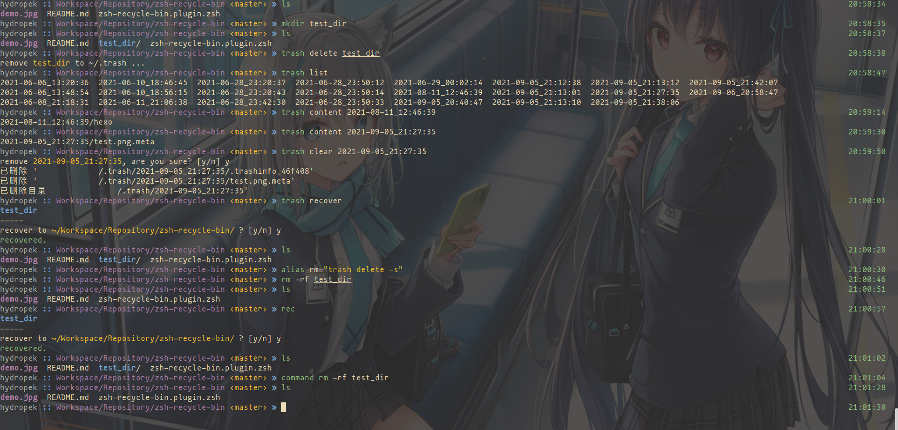

# zsh-recycle-bin

A recycle bin runned in command line for Bash and Zsh

## install

### oh-my-zsh

1. clone the repo
```
git clone https://github.com/ycpedef/zsh-recycle-bin.git ${ZSH_CUSTOM:-~/.oh-my-zsh/custom}/plugins/zsh-recycle-bin
```

2. activate the plugin in ~/.zshrc:

```
plugins=( [plugins...] zsh-recycle-bin)
```

### zsh (manual)
```
git clone https://github.com/ycpedef/zsh-recycle-bin.git
echo "source ${(q-)PWD}/zsh-recycle-bin/zsh-recycle-bin.plugin.zsh" >> ${ZDOTDIR:-$HOME}/.zshrc
```

### bash (manual)
```
git clone https://github.com/ycpedef/zsh-recycle-bin.git
echo "source $(pwd)/zsh-recycle-bin/zsh-recycle-bin.plugin.zsh" >> $HOME/.bashrc
```

## usage

```bash
$ trash delete [filename]    # put file to recycle bin         
$ trash recover              # recover latest trash        
$ trash recover [trashname]  # recover [trashname]        
$ trash list                 # display trashname in recycle bin
$ trash clear                # real remove trash which is not created today
$ trash clear [trashname]    # real remove trash [trashname]
$ trash content              # display details of files in recyble bin
$ trash content [trashname]  # display details of [trashname] 
$ trash version              # display version

# also can use del as `trash delete`, rec as `trash recover`

```

**suggested to add in ~/.bashrc or ~/.zshrc:**

```bash
alias rm="trash delete -s"
```

## demo


